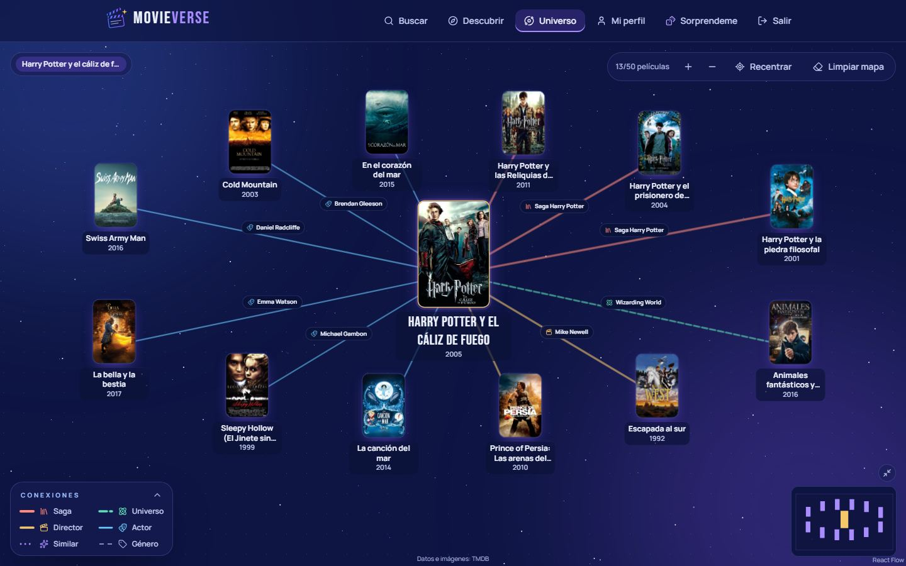
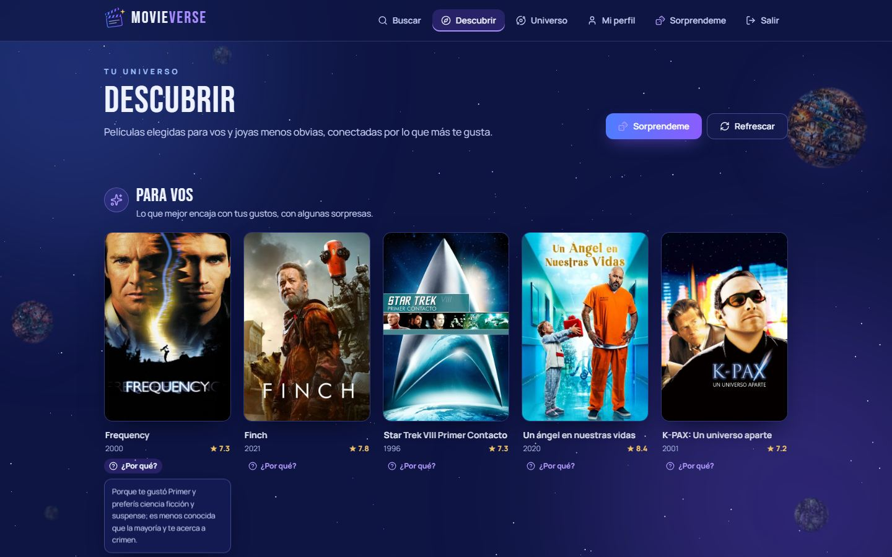
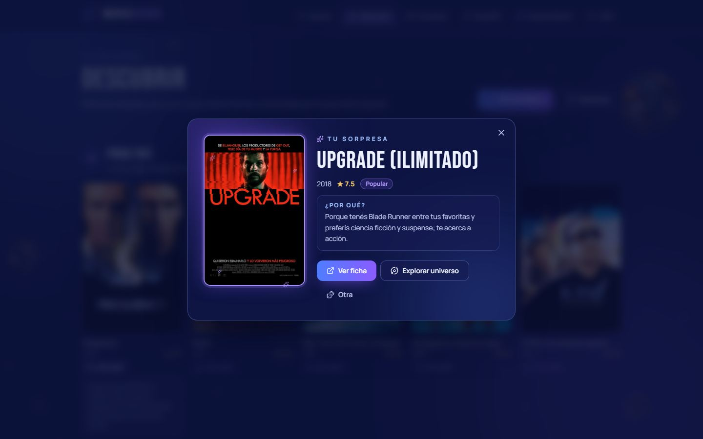
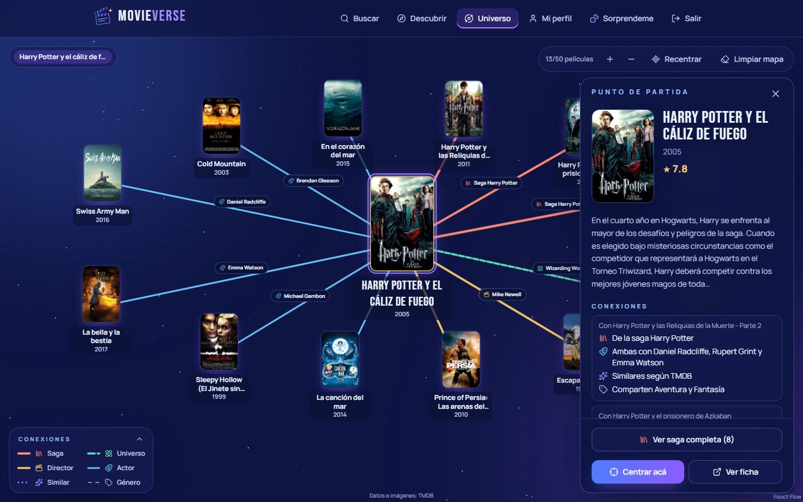
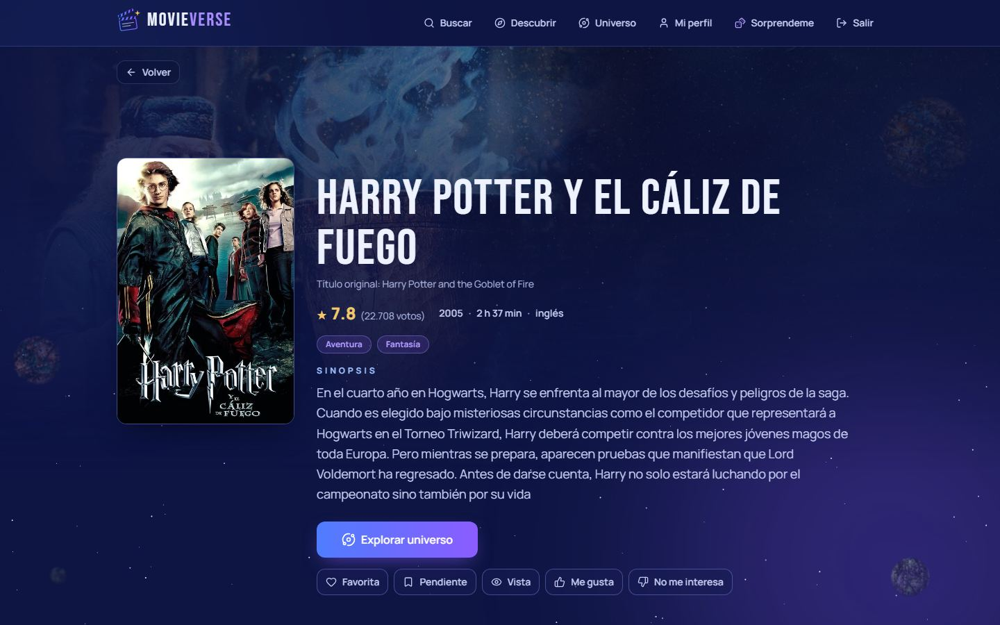
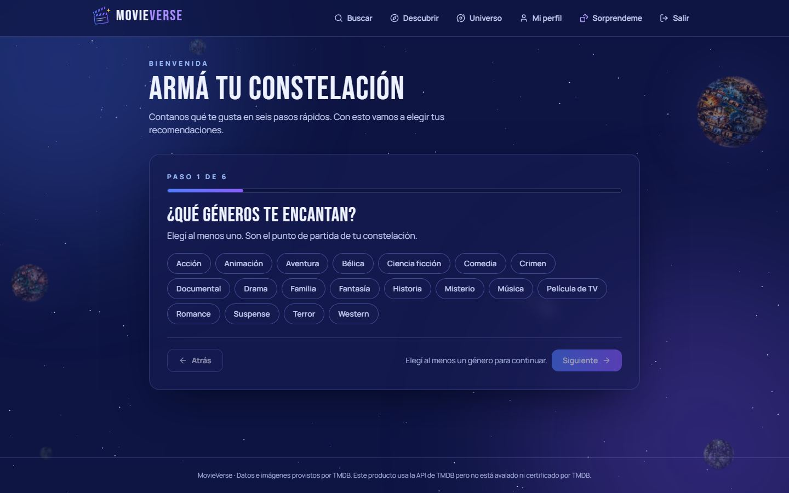
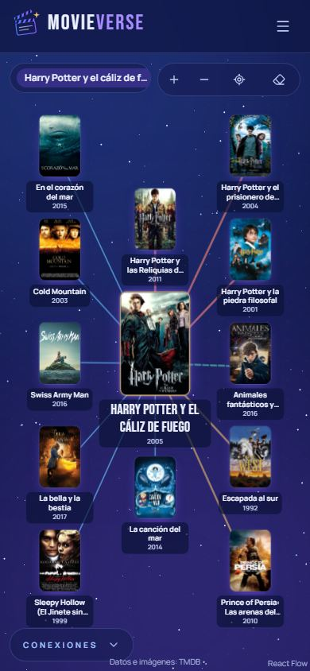

# 🎬 MovieVerse

**Descubrí películas explorando cómo se conectan.**

MovieVerse es una plataforma web para encontrar qué ver sin terminar siempre en los mismos títulos populares. Combina **recomendaciones personalizadas con sesgo de descubrimiento** (cada una explica su porqué) con un **Mapa Cinematográfico Interactivo**: una película queda en el centro y se conecta con otras por saga, universo compartido, director, actores, similitud y género. Hacés clic en una, la expandís y seguís explorando.

> Hipótesis del MVP: un usuario descubre cine relevante y menos obvio explorando conexiones entre películas, en lugar de depender sólo de rankings de popularidad.



## Qué incluye el MVP

| | Funcionalidad |
|---|---|
| 🔐 | Registro e inicio de sesión (JWT) |
| 🏠 | **Home**: hero con las películas en tendencia de la semana, «¿Cómo te sentís hoy?» (6 estados de ánimo) y carruseles de tendencias, recomendaciones y lo último que exploraste en el mapa |
| 🧭 | Onboarding en 6 pasos: géneros favoritos y a evitar, décadas, idiomas, nivel de descubrimiento (Familiar · Equilibrado · Explorador) y valoración rápida |
| 🔎 | Búsqueda en TMDB con autocompletado y ficha completa (sinopsis, director, reparto, puntaje) |
| ⭐ | Favoritas, pendientes, vistas, «Me gusta» y «No me interesa» |
| ✨ | **Descubrir**: «Para vos», «Joyas para descubrir» y «Continuá explorando», cada película con su «¿Por qué?». El feedback cambia las siguientes recomendaciones |
| 🎲 | **Modo sorpresa**: una película al azar entre tus mejores recomendaciones (nunca la obvia número 1, con prioridad para las menos conocidas) |
| 🌌 | **Mapa cinematográfico**: conexiones por saga, universo (Marvel, DC, Wizarding World, MonsterVerse, El Conjuro), director, actor, similitud y género; chips con el motivo, filtro por tipo, expansión, recorrido, «Ver saga completa» |
| 👤 | Mi perfil: listas y preferencias editables |

Fuera del MVP (ver [Roadmap](#roadmap)): series, maratones, estadísticas, logros, amigos, camino entre dos películas, dónde verla.

## Capturas

| Descubrir con «¿Por qué?» | Modo sorpresa |
|---|---|
|  |  |

| Panel de una película en el mapa | Ficha |
|---|---|
|  |  |

| Onboarding | Mapa en el celular |
|---|---|
|  |  |

## Stack

| Capa | Tecnología |
|---|---|
| Frontend | React 19 + Vite + TypeScript, Tailwind CSS 4, React Router, TanStack Query, React Hook Form + Zod, React Flow (`@xyflow/react`), Lucide |
| Backend | Python 3.12+, Django 5.2, Django REST Framework, SimpleJWT, django-cors-headers |
| Base de datos | PostgreSQL 16 (también funciona como caché de TMDB) |
| API externa | [TMDB](https://www.themoviedb.org/), consumida **sólo** desde el backend |
| Tests | pytest + pytest-django · Vitest + Testing Library |
| Calidad | Ruff · ESLint · `tsc` · GitHub Actions (`.github/workflows/ci.yml`) |

## Arquitectura resumida

```text
React (Vite)  ──JWT──▶  Django REST /api/v1  ──▶  PostgreSQL (datos + caché de TMDB)
                               │
                               └──▶ TMDB (sólo desde el backend, con timeout y caché)
```

El backend está dividido en apps con un servicio por responsabilidad; las vistas sólo validan y delegan:

| App | Servicio | Qué hace |
|---|---|---|
| `movies` | `MovieService`, `TMDBClient` | Búsqueda, detalle, créditos, sagas y keywords; cachea todo en PostgreSQL (`TMDB_CACHE_DAYS`) |
| `preferences` | `TasteProfileService` | Onboarding y perfil de gustos (pesos por género, semillas, firma del perfil) |
| `interactions` | `InteractionService` | Favorita, pendiente, vista, like/dislike, siempre del usuario autenticado |
| `recommendations` | `RecommendationService` | Candidatos → score (afinidad, novedad, calidad, exploración, penalización por popularidad) → re-ranking con diversidad → explicación. Persiste el resultado y lo regenera cuando cambia el feedback. Modo sorpresa |
| `graph` | `GraphService` | Vecindario de una película a demanda (sin base de grafos): SAGA, UNIVERSO, DIRECTOR, ACTOR, SIMILAR, GÉNERO, con fuerza, motivo verificable y topes de diversidad |

El frontend sólo muestra: no calcula recomendaciones ni conexiones. Detalle en [`docs/ARCHITECTURE.md`](docs/ARCHITECTURE.md), [`docs/RECOMMENDER_SPEC.md`](docs/RECOMMENDER_SPEC.md), [`docs/GRAPH_SPEC.md`](docs/GRAPH_SPEC.md) y el sistema de diseño en [`docs/DESIGN_SYSTEM.md`](docs/DESIGN_SYSTEM.md).

## Levantarlo desde cero en Windows

### 1. Requisitos

- [Docker Desktop](https://www.docker.com/products/docker-desktop/) (incluye Docker Compose)
- [Node.js](https://nodejs.org/) **22.12+** (la CI usa Node 24)
- [Git](https://git-scm.com/)
- Una API key de TMDB, gratuita: <https://www.themoviedb.org/settings/api> (sirve la «API Key» v3 o el «API Read Access Token» v4)
- Opcional, sólo para correr el backend o sus tests fuera de Docker: Python **3.12+**

### 2. Clonar y configurar el `.env`

En PowerShell:

```powershell
git clone https://github.com/alisonbrandanbre-coder/movieverse.git
cd movieverse
Copy-Item .env.example .env
Copy-Item frontend\.env.example frontend\.env
```

Abrí `.env` y completá `TMDB_API_KEY=...`. El resto de los valores sirve para desarrollo tal como viene.

> Si los puertos 5432 u 8000 ya están ocupados, cambiá `POSTGRES_HOST_PORT` / `BACKEND_HOST_PORT` en `.env` y usá el mismo puerto en `VITE_API_URL` de `frontend\.env` (por ejemplo `http://localhost:8001/api/v1`).

### 3. Base de datos y backend (Docker)

```powershell
docker compose up -d --build
```

Levanta PostgreSQL y el backend y **aplica las migraciones al iniciar**. Comprobá que responde: <http://localhost:8000/api/v1/health>.

Si cambiaste el `.env` después, recreá el contenedor (`restart` no relee el `.env`):

```powershell
docker compose up -d --force-recreate backend
```

### 4. Datos de demo

```powershell
docker compose exec backend python manage.py seed_demo
```

Crea (o reinicia) los dos usuarios de demo, sus películas desde TMDB, su onboarding, favoritas, vistas y likes, genera sus recomendaciones y deja calculados los mapas del guion de demo. Tarda alrededor de un minuto la primera vez. Se puede correr de nuevo cuando quieras volver al estado inicial.

### 5. Frontend

```powershell
cd frontend
npm ci
npm run dev
```

Abrí <http://localhost:5173> y entrá con un usuario de demo.

> Si usás otro puerto para el frontend, agregalo a `CORS_ALLOWED_ORIGINS` en `.env` y recreá el backend.

### Alternativa: backend sin Docker

Con PostgreSQL corriendo (`docker compose up -d db`):

```powershell
cd backend
python -m venv .venv
.venv\Scripts\activate
pip install -r requirements-dev.txt
python manage.py migrate
python manage.py seed_demo
python manage.py runserver
```

## Usuarios de demo

Contraseña de ambos: **`MovieVerse-demo-2026`** (sólo para el entorno local de demo).

| Usuario | Gustos | Nivel | Qué tiene cargado |
|---|---|---|---|
| `explorador@movieverse.example` | Ciencia ficción, suspense y misterio; evita romance, comedia, documentales y películas de TV; 1990–2010, inglés | Explorador | Favoritas: Interstellar, Blade Runner, La llegada · Vistas: Matrix, Origen, 2001 · Me gusta: Moon, Ex Machina, Gattaca, Primer · Pendiente: Dune |
| `familiar@movieverse.example` | Comedia, romance y familia; evita terror, ciencia ficción y películas de TV; 1990–2010, inglés y español | Familiar | Favoritas: Notting Hill, Love Actually, Mamma Mia! · Vistas: La proposición, Crazy, Stupid, Love · Me gusta: Una cuestión de tiempo, La La Land, Paddington 2, El diablo viste de Prada |

Con perfiles opuestos, la misma pantalla Descubrir muestra recomendaciones muy distintas. El guion de la presentación está en [`docs/DEMO_SCRIPT.md`](docs/DEMO_SCRIPT.md).

## Tests y calidad

Los tests **nunca** acceden a internet: TMDB está simulado.

Backend (requiere PostgreSQL corriendo):

```powershell
cd backend
.venv\Scripts\activate
ruff check .
ruff format --check .
pytest
```

O, dentro del contenedor: `docker compose exec backend pytest`.

Frontend:

```powershell
cd frontend
npm run lint
npm run typecheck
npm test
npm run build
```

La CI de GitHub Actions corre estos mismos pasos en cada push a `main` y en cada pull request.

## API

Base `/api/v1`, autenticación JWT (`Authorization: Bearer …`). Los errores tienen siempre la forma `{"error": {"code", "message", "details?"}}`. Contratos completos en [`docs/API_GUIDELINES.md`](docs/API_GUIDELINES.md).

| Método | Ruta | Descripción |
|---|---|---|
| GET | `/health` | Estado de la API y la base de datos (sin auth) |
| POST | `/auth/register` · `/auth/login` · `/auth/refresh` · `/auth/logout` | Cuenta y sesión |
| GET | `/auth/me` | Usuario autenticado |
| GET | `/movies/search?q=&page=` | Búsqueda en TMDB (resultados cacheados localmente); acepta los mismos filtros que discover |
| GET | `/movies/discover?genres=&providers=&decade=&rating=&runtime=&countries=&popularity=&sort=&hide_watched=&page=` | Catálogo filtrado sin texto (TMDB discover, caché de 12 h) |
| GET | `/movies/providers` · `/movies/{id}/providers` | Plataformas de streaming de Argentina y "Dónde verla" de una película |
| GET | `/movies/trending` | Tendencias de la semana (caché de 6 h) |
| GET | `/movies/mood/{slug}?page=` | Películas para un estado de ánimo de la Home |
| GET | `/movies/{id}` · `/movies/{id}/credits` | Ficha y créditos |
| GET · PUT | `/preferences` | Preferencias |
| POST | `/preferences/onboarding` | Guarda el onboarding completo |
| GET | `/preferences/options` · `/movies/onboarding-sample` | Opciones y títulos para valorar en el onboarding |
| GET · POST · DELETE | `/movies/{id}/interactions[/{type}]` | Favorita, pendiente, vista, like, dislike |
| GET | `/me/favorites` · `/me/watchlist` · `/me/watched` · `/me/likes` | Listas del usuario |
| GET | `/recommendations` · POST `/recommendations/refresh` | Recomendaciones en 3 secciones, con score y explicación |
| GET | `/recommendations/surprise?exclude=` | Modo sorpresa: 3 películas distintas (`exclude` = la tanda anterior) |
| GET | `/graph/movies/{id}?limit=12` | Vecindario de una película en el mapa |
| GET | `/graph/movies/{id}/saga` | Todas las películas de su saga |

## Atribución de TMDB

Este producto usa la API de TMDB pero no está avalado ni certificado por TMDB. Los datos e imágenes de películas provienen de [The Movie Database (TMDB)](https://www.themoviedb.org/). La aplicación muestra esta atribución en el pie de todas las pantallas y en el mapa.

## Roadmap

El MVP prioriza el mapa y las recomendaciones. Quedan para las próximas iteraciones ([`docs/ROADMAP.md`](docs/ROADMAP.md)):

| Iteración | Funcionalidad |
|---|---|
| Sprint 6 | **Maratones**: secuencias de películas para una noche o un fin de semana (por saga, director o tema) |
| Sprint 7 | **Estadísticas** personales (géneros, décadas, directores más vistos) · **logros** por explorar |
| Sprint 8 | **Amigos** y **compatibilidad** de gustos entre dos usuarios |
| Sprint 9 | **Camino entre dos películas**: el recorrido más corto en el mapa (Interstellar → Amélie) |
| Sprint 10 | **Dónde verla** (plataformas de streaming) · estrenos · series |

## Documentación del proyecto

- [`docs/PROJECT_CONTEXT.md`](docs/PROJECT_CONTEXT.md): problema, propuesta, reglas y criterios de aceptación
- [`docs/SPRINT_PLAN.md`](docs/SPRINT_PLAN.md) y los reportes `docs/SPRINT_0_REPORT.md` … `docs/SPRINT_5_REPORT.md`
- [`docs/DEMO_SCRIPT.md`](docs/DEMO_SCRIPT.md): guion de la demo de 5 minutos
- [`CLAUDE.md`](CLAUDE.md) y `agents/`: guías para agentes de IA que trabajan en el repo
